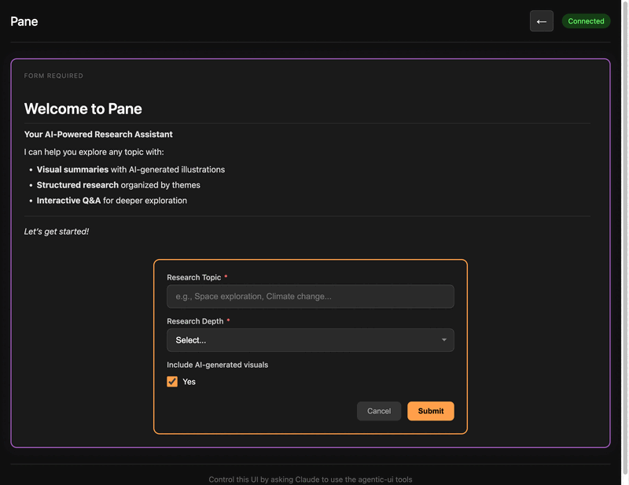

# Pane

AI-controllable UI canvas with state machine architecture.



## Architecture

```
Claude Code <--stdio--> MCP Server <--WebSocket--> Vue Frontend
                            |
                        XState Machine
                        (holds state)
```

## Quick Start

### 1. Install Dependencies

```bash
cd mcp-server && bun install
cd frontend && bun install
```

### 2. Start the Frontend

```bash
cd frontend
bun run dev
# Opens at http://localhost:3000
```

### 3. Add MCP Server to Claude Code

Add to your Claude Code MCP settings:

```json
{
  "mcpServers": {
    "pane": {
      "command": "bun",
      "args": ["run", "/path/to/pane/mcp-server/src/index.ts"]
    }
  }
}
```

### 4. Restart Claude Code

After adding the MCP server config, restart Claude Code to load the new tools.

## Features

- **Text & Markdown Display** - Rich content with Mermaid diagram support
- **User Input Forms** - Single and multi-field forms with various input types
- **Long-Polling** - Auto-trigger when user submits (no manual Enter needed)
- **State Persistence** - Full state restoration across MCP restarts
- **User Context** - Persistent key-value storage across interactions

## MCP Tools

| Tool | Description |
|------|-------------|
| `get_app_info` | Get app info and capabilities |
| `get_current_state` | Get current state, text, and available actions |
| `execute_action` | Execute actions (set_text, set_markdown, clear, undo, reset) |
| `show_input_form` | Display single-field input form |
| `show_multi_form` | Display multi-field form |
| `get_user_input` | Long-poll for user input (blocks until submitted) |
| `get_user_context` | Get persistent user context values |
| `set_user_context` | Set a user context value |
| `clear_user_context` | Clear all user context |

## Development

### MCP Server
```bash
cd mcp-server
bun run dev
```

### Frontend
```bash
cd frontend
bun run dev
```

## License

MIT
